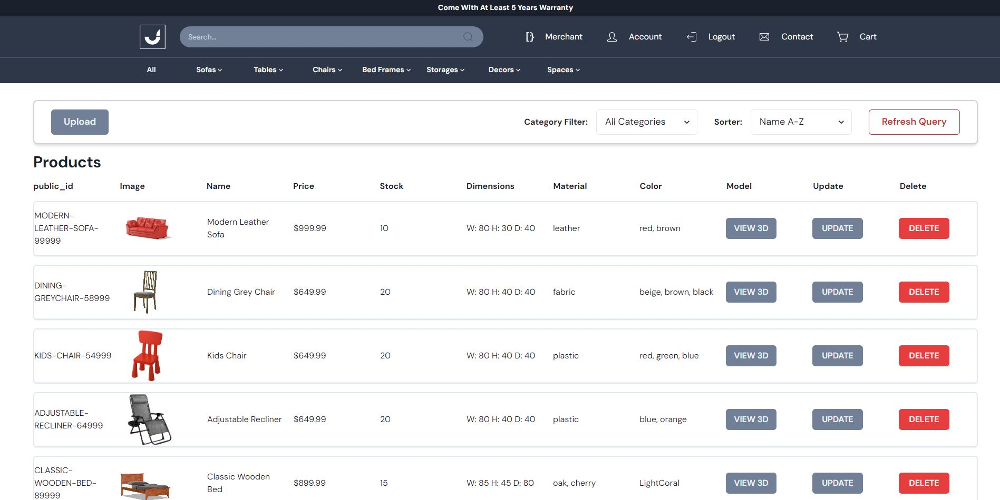

# JippyHome 3D E-Commerce

## Summary

This e-commerce website allows users to browse and purchase furniture with excellent catalogs. The app provides a seamless shopping experience with a responsive 3D model previewer to allow shoppers to see the furniture in a 3 dimensions.

## Key Features

- **3D model previewer:**
   
  Preview the model in 3D with different lighting modes.
- **Product Catalog:**
   
  Display a wide range of products with detailed descriptions, images, and pricing.
- **Shopping Cart:**
   
  Offer a smooth checkout process with various payment and shipping options.
- **Checkout Process:**
   
  Provide a streamlined checkout process with options for payment and shipping.
- **Admin Dashboard:**
   
 Provide an admin dashboard for managing products, orders, inventory, and user accounts.
- **Responsive Design:**
   
  Ensure the website adapts to different devices and screen sizes for an optimal user experience.
- **Performance Optimization:**
   
  Enhance website performance for quick load times and easy navigation.

## Deployed URL

You can access the deployed URL at [JippyHome 3D E-Commerce](https://jippyhome-3d-e-commerce.onrender.com/).

## Website Screenshots

|                             **Landing Page**                              |                           **Signup Page**                            |
| :-----------------------------------------------------------------------: | :------------------------------------------------------------------: | 
|                         |                         |
|                              **Login Page**                               |                           **Account Page**                           |                  
|                          |                      |
|                              **Store Page**                               |                           **Category Page**                          |                  
|                          |                    |
|                         **Product Page**                                  |                    **3D Preview Modal (Default)**                    |                  
|                      |            |
|                      **3D Preview Modal (Warm)**                          |                      **3D Preview Modal (Cool)**                     |                  
|     |      |
|                              **Category Bar**                             |                          **Checkout Page**                           |                  
|                      |                   |
|                              **Contact Page**                             |                          **Merchant Page**                           |                  
|                      |                   |

## Technologies Used

### Front-End

- **Project Setup**
  - **Vite**
  - **React**
  - **Typescript**
- **React Tools**
  - **React Three Fiber**
  - **React Three Drei**
  - **Three.js**
  - **React Router**
  - **React Icons**
  - **React Intersection Observer**
- **Chakra UI**
- **Tailwind CSS**
- **Snipcart API**

### Back-End
- **Node.js**
- **Express.js**
- **MongoDB + Mongoose:**
   
  For database management
- **Cloudinary API:**
   
  For image cloud & 3d model management

### Tools and Dependencies

- **Ngrok**
- **Crypto.js**
- **dotenv**

## Challenges Faced

### Cloudinary problems

- **Implementing uploading 3D model:**
   
  I couldn't upload 3D model at first so I have to check with the snipcart team what went wrong.
- **Implementing snipcart with backend to record order id:**
   
  I had a hard time trying to respond back to snipcart.

### Snipcart problems

- **Implementing Snipcart webhooks:**
   
  I had a hard time to understand how to use webhook for the first time, but I managed to pull through after reading the document properly.
- **Implementing snipcart with backend to record order id :**
   
  I had a hard time trying to response back to snipcart.

## Next Steps

### Planned Future Enhancements

- **Website Responsiveness & Compatibility:**
   
  Implement responsive design and ensure compatibility across all device sizes.
- *More product suggestions:**
   
  Implement related products, new products, on-sale products.
- **Product Reviews:**
   
  Enable users to leave reviews and ratings for products.
- **Wishlist:**
   
  Add a wishlist feature for users to save products they are interested in.
- **Social Media Sharing:**
   
  Integrate with social media platform sharing like Whatsapp, Facebook, etc.
- **User account management:**
   
  Manage user accounts so that I can control who has access to certain features.
- **Discount system:**
   
  I want user to able to apply discount code to their cart.
- **Newsletter system:**
   
  I want user to sign up for newsletter so that can stay updated on new products & promotions.

For more details and updates, stay tuned to the repository and the project board.
